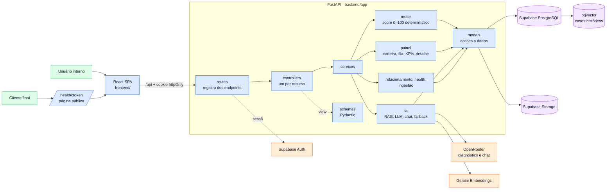
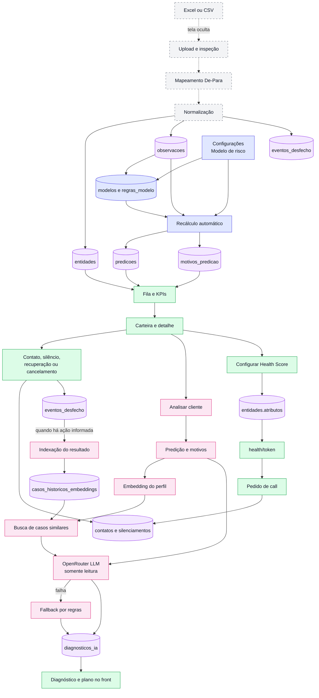
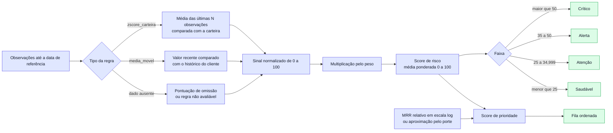

# Arquitetura e fluxos técnicos da Sinalys

Este documento descreve a implementação atual do repositório: um monorepo com a API em Python (FastAPI) em [`backend/`](../backend/) e a interface em React (Vite) em [`frontend/`](../frontend/). Ele complementa o [`README.md`](../README.md).

## Visão de arquitetura



### Responsabilidade de cada camada (MVC no backend)

| Camada | Pasta | Responsabilidade |
| --- | --- | --- |
| Routes | `backend/app/routes/` | declara caminho, dependências (sessão) e view de saída; delega ao controller |
| Controllers | `backend/app/controllers/` | um por recurso; recebe a requisição validada, chama services e devolve o resultado — sem regra de negócio |
| Views | `backend/app/schemas/` | schemas Pydantic de entrada e saída (o "formato" da API; não há HTML) |
| Services | `backend/app/services/` | regras de negócio: motor de score, painel, orquestração da LLM, fallback por regras, contatos, health score, ingestão |
| Models | `backend/app/models/` | uma camada por tabela do Supabase (consultas, RPC do pgvector, Storage, Auth) |
| Frontend | `frontend/src/` | páginas (`pages/`), componentes por feature (`components/`), hooks de dados (`hooks/`) |

A sessão é do Supabase Auth, guardada em **cookies httpOnly** emitidos pela API; o navegador nunca vê o token. Toda rota sob `/api`, exceto login e as duas rotas da página pública, exige sessão (`401` sem ela). O projeto é resolvido por `app_metadata.projeto_id` do usuário e, na ausência dele, por `DEFAULT_PROJETO_ID`.

Em desenvolvimento o Vite encaminha `/api` para a API (`VITE_API_URL`), então frontend e backend ficam na mesma origem e não há CORS nem cookie de terceiros.

## Fluxo operacional de ponta a ponta

As linhas contínuas representam o ciclo disponível no produto. A ingestão aparece tracejada porque sua tela está oculta por `EXIBIR_INGESTAO = false`, embora o wizard e as APIs estejam implementados.



## Motor de risco e fila



O score persistido em `predicoes.pontuacao` é:

```text
score_risco = soma(pontuacao_normalizada × peso) / soma(pesos avaliáveis)
cobertura   = regras avaliáveis / total de regras
```

É um índice operacional de 0 a 100, sem validação estatística — não é probabilidade. A ausência só conta como risco quando a regra define `pontuacao_omissao`; caso contrário, ela reduz a cobertura sem adicionar pontos. A data de referência padrão é a observação mais recente do projeto, evitando que uma base histórica pareça vazia por causa da data atual.

A fila usada pelo painel calcula dinamicamente:

```text
impacto_relativo  = posição logarítmica do MRR entre o menor e o maior MRR ativo
score_prioridade  = score_risco × (0,5 + impacto_relativo)
exposicao_anual   = MRR × 12 × score_risco / 100
```

Sem MRR válido, o porte fornece uma aproximação de impacto. A prioridade não é persistida: ela é derivada ao montar o painel ([`services/painel/clientes.py`](../backend/app/services/painel/clientes.py)). O endpoint legado `GET /api/motor/fila` ainda expõe `score_urgencia = risco × valor_impacto`.

Os testes do motor estão em [`backend/tests/test_motor.py`](../backend/tests/test_motor.py).

## Fluxos de IA

### Diagnóstico sob demanda

1. `POST /api/inteligencia/analisar` resolve o cliente e lê sua última predição persistida — o motor não é recalculado.
2. [`services/ia/contexto.py`](../backend/app/services/ia/contexto.py) reúne faixa, score, cobertura e motivos do motor.
3. Gemini transforma a descrição do perfil em um embedding de 768 dimensões.
4. A função PostgreSQL `buscar_casos_similares` consulta até três casos do mesmo projeto por distância cosseno.
5. OpenRouter recebe contexto atual e casos recuperados e devolve JSON validado (Pydantic) com diagnóstico, análise lookalike e plano imediato.
6. Se a LLM falhar (cota, timeout, resposta fora do contrato), [`services/ia/fallback.py`](../backend/app/services/ia/fallback.py) monta o diagnóstico só com regras; o front identifica essa origem.
7. O backend grava o resultado em `diagnosticos_ia` (cache por predição). A LLM não tem acesso ao banco e não altera score nem motivos.

Sem predição, a análise responde `422`: o motor precisa rodar antes. Sem casos históricos, a IA trabalha apenas com o contexto atual e declara a ausência de lookalikes.

### Assistente conversacional

`POST /api/inteligencia/chat` responde em streaming (NDJSON: uma linha JSON por evento) e recebe também a rota atual. Em `/clientes/:id`, isso permite resolver "este cliente" sem pedir o código novamente. O modelo pode chamar apenas ferramentas de leitura ([`chat_ferramentas.py`](../backend/app/services/ia/chat_ferramentas.py)):

- `listar_fila_prioridade`;
- `resumo_carteira`;
- `detalhar_cliente`;
- `buscar_casos_similares`.

O chat não registra contatos, não altera score e não executa ações em nome do analista.

### Feedback e memória

"Marcar como resolvido" chama `POST /api/inteligencia/feedback`, exige a descrição da ação, gera um embedding no Gemini e grava um item em `casos_historicos_embeddings`. "Marcar como cancelado" chama `POST /api/eventos/cancelar`, sempre grava o evento e só tenta indexar o caso quando o analista também descreve o que foi tentado.

## Health Score público

O token público pertence à entidade e não é o ID interno nem o código exibido no painel. A configuração é armazenada em `entidades.atributos` e permite selecionar apenas conteúdo positivo: destaques de métricas dentro do esperado, benefícios do plano e URL de agendamento opcional.

A página `/health/:token` (dados em `GET /api/health/publico/{token}`) não mostra score, faixa de risco, MRR ou alertas. Sem URL externa de agenda, `POST /api/health/agendamento` grava o pedido como contato no histórico da entidade. As duas rotas são públicas, com validação de entrada e campo honeypot.

## Mapa da API

A documentação interativa fica em `http://localhost:8000/docs` com a API rodando.

| Área | Endpoints | Uso no front |
| --- | --- | --- |
| Autenticação | `POST /api/auth/login`, `POST /api/auth/logout`, `GET /api/auth/me` | sessão por cookie httpOnly |
| Painel | `GET /api/painel/inicio`, `/inicio/kpis`, `/clientes`, `/fila`, `/kpis` | início, carteira e recuperação |
| Clientes | `GET /api/clientes/{id}` | detalhe: evidências, explicação, evolução, simulador |
| Motor | `POST /api/motor/calcular`, `GET /api/motor/fila` | recálculo ao entrar e fila técnica |
| Modelo | `GET /api/modelo`, `PATCH/POST /api/modelo/regras` | calibração; mudanças recalculam a carteira |
| IA | `POST /api/inteligencia/analisar`, `/chat`, `/feedback` | diagnóstico, conversa em stream e memória |
| Operação | `GET/POST /api/contatos`, `POST/DELETE /api/alertas/silenciar`, `POST /api/eventos/cancelar` | ações sobre clientes |
| Health | `GET /api/health/publico/{token}`, `POST /api/health/agendamento`, `PUT /api/health/configuracao` | página pública e personalização |
| Ingestão | `POST /api/ingestao/upload`, `GET/POST /api/ingestao/mapeamento`, `POST /api/ingestao/processar`, `GET/POST /api/definicoes-metricas` | implementados, sem entrada visível enquanto a flag estiver desligada |

A API usa a chave service-role do Supabase (atravessa RLS) e por isso ela existe apenas no backend.

## Dados persistidos

O schema está em [`backend/db/modelagem.sql`](../backend/db/modelagem.sql) e as políticas em [`backend/db/rls.sql`](../backend/db/rls.sql).

| Grupo | Tabelas principais | Conteúdo |
| --- | --- | --- |
| Organização | `organizacoes`, `projetos`, `entidades` | tenancy, configuração do projeto e cadastro flexível do cliente |
| Ingestão | `execucoes_ingestao`, `mapeamentos_importacao`, `definicoes_metricas`, `observacoes` | origem, De-Para, catálogo e série temporal |
| Risco | `modelos`, `regras_modelo`, `predicoes`, `motivos_predicao` | versão do modelo, pesos, score e explicabilidade |
| Operação | `contatos`, `silenciamentos_alerta`, `eventos_desfecho` | histórico do time, supressões e resultados |
| Inteligência | `casos_historicos_embeddings`, `diagnosticos_ia` | memória vetorial e análises geradas |

## Feature flags

As flags ficam em [`frontend/src/lib/config/features.ts`](../frontend/src/lib/config/features.ts):

```ts
export const EXIBIR_INGESTAO = false;
export const EXIBIR_PLAYBOOK = false;
export const EXIBIR_RELATORIOS = false;
```

Com os valores atuais, as três rotas não aparecem na navegação e redirecionam para `/`. Ingestão possui backend conectado; Playbook e Relatórios usam dados de demonstração (`frontend/src/lib/mock/dados.ts`).
