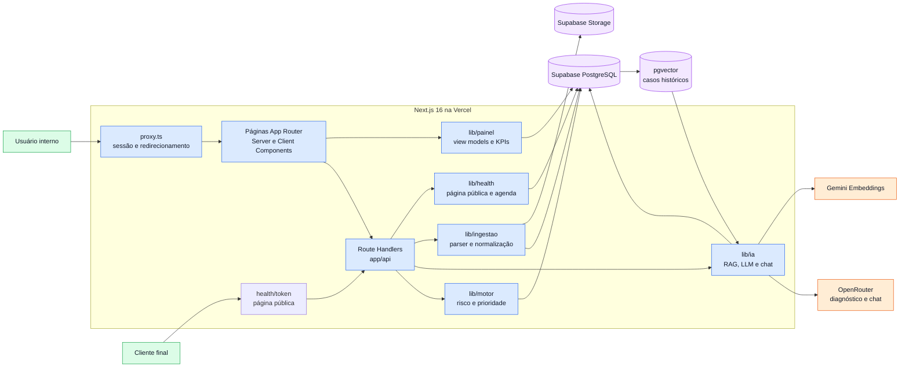
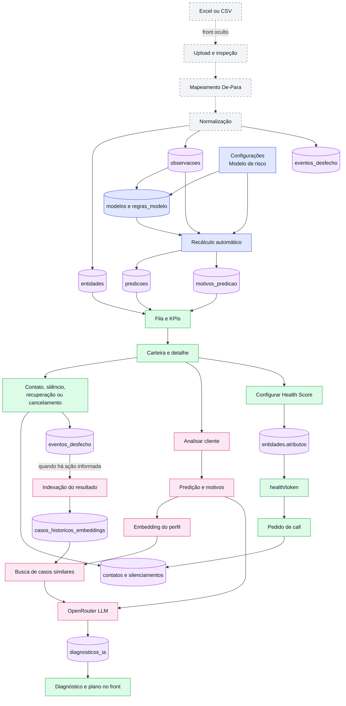
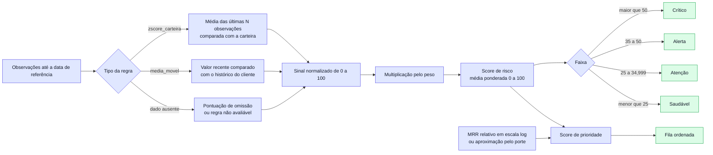

# Arquitetura e fluxos técnicos da Sinalys

Este documento descreve a implementação atual do repositório. Ele complementa o guia funcional do [`README.md`](../README.md) e diferencia o caminho usado pelo front hoje dos módulos que existem, mas permanecem ocultos por feature flag.

## Visão de arquitetura



### Responsabilidade de cada camada

| Camada                       | Responsabilidade                                                                     |
| ---------------------------- | ------------------------------------------------------------------------------------ |
| `app/`                     | compõe páginas, layouts e endpoints; o grupo`app/(app)` exige sessão            |
| `components/` e `hooks/` | interação da interface, estado local e chamadas HTTP                               |
| `lib/painel/`              | transforma registros do Supabase nos dados exibidos em dashboard, carteira e detalhe |
| `lib/motor/`               | normaliza sinais, calcula predições, cobertura, faixas e prioridade                |
| `lib/ia/`                  | monta contexto, busca lookalikes, chama modelos e persiste diagnósticos/embeddings  |
| `lib/ingestao/`            | inspeciona Excel/CSV e converte colunas arbitrárias para o modelo universal         |
| `lib/health/`              | controla conteúdo seguro da página pública e pedidos de call                      |
| `lib/supabase/`            | separa cliente de sessão e cliente administrativo usado no servidor                 |

As páginas autenticadas são protegidas pelo `proxy.ts`, que renova a sessão Supabase e redireciona visitantes sem sessão para `/login`. O projeto é resolvido primeiro por `app_metadata.projeto_id` do usuário e, na ausência dele, por `DEFAULT_PROJETO_ID`.

## Fluxo operacional de ponta a ponta

As linhas contínuas representam o ciclo disponível no produto. A ingestão aparece tracejada porque seu front está desativado por `EXIBIR_INGESTAO = false`, embora o wizard e as APIs estejam implementados.



## Motor de risco e fila



O score persistido em `predicoes.pontuacao` é:

```text
score_risco = soma(pontuacao_normalizada × peso) / soma(pesos avaliáveis)
cobertura   = regras avaliáveis / total de regras
```

A ausência só conta como risco quando a regra define `pontuacao_omissao`; caso contrário, ela reduz a cobertura sem adicionar pontos. A data de referência padrão é a observação mais recente do projeto, evitando que uma base histórica pareça vazia por causa da data atual.

A fila usada pelo painel calcula dinamicamente:

```text
impacto_relativo   = posição logarítmica do MRR entre o menor e o maior MRR ativo
score_prioridade  = score_risco × (0,5 + impacto_relativo)
```

Sem MRR válido, o porte fornece uma aproximação de impacto. A prioridade não é persistida: ela é derivada ao montar o painel. O endpoint legado `GET /api/motor/fila` ainda expõe `score_urgencia = risco × valor_impacto`; o front atual usa o cálculo relativo de `lib/motor/urgencia.ts` por meio de `lib/painel/`.

## Fluxos de IA

### Diagnóstico sob demanda

1. `POST /api/inteligencia/analisar` resolve o cliente e lê sua última predição persistida.
2. `lib/ia/contexto.ts` reúne faixa, score, cobertura e motivos do motor.
3. Gemini transforma a descrição do perfil em um embedding de 768 dimensões.
4. a função PostgreSQL `buscar_casos_similares` consulta até três casos do mesmo projeto por distância cosseno;
5. OpenRouter recebe contexto atual e casos recuperados e devolve JSON validado com diagnóstico, análise lookalike e plano imediato;
6. o resultado é salvo em `diagnosticos_ia`; reanálise pode forçar uma nova geração, enquanto a leitura normal pode reutilizar cache;
7. se a geração externa falhar, a camada de IA pode devolver um plano determinístico de fallback, identificado no front como tal.

Sem predição, a análise responde `422`: o motor precisa rodar antes. Sem casos históricos, a IA deve trabalhar apenas com o contexto atual e declarar a ausência de lookalikes.

### Assistente conversacional

`POST /api/inteligencia/chat` usa streaming e recebe também a rota atual. Em `/clientes/[id]`, isso permite resolver expressões como “este cliente” sem pedir o código novamente. O modelo pode chamar apenas ferramentas de leitura:

- `listar_fila_prioridade`;
- `resumo_carteira`;
- `detalhar_cliente`;
- `buscar_casos_similares`.

O chat não registra contatos, não altera score e não executa ações em nome do analista.

### Feedback e memória

“Marcar como resolvido” chama `POST /api/inteligencia/feedback`, exige a descrição da ação, gera um embedding no Gemini e grava um item em `casos_historicos_embeddings`. “Marcar como cancelado” chama `POST /api/eventos/cancelar`, sempre grava o evento e só tenta indexar o caso quando o analista também descreve o que foi tentado. Um caso indexado passa a ser candidato nas próximas buscas de casos semelhantes.

## Health Score público

O token público pertence à entidade e não é o ID interno nem o código exibido no painel. A configuração é armazenada em `entidades.atributos` e permite selecionar apenas conteúdo positivo:

- destaques de métricas dentro do esperado;
- benefícios do plano;
- URL de agendamento opcional.

A página `/health/[token]` não mostra score, faixa de risco, MRR ou alertas. Quando não há URL externa de agenda, `POST /api/health/agendamento` grava o pedido como contato no histórico da entidade. A rota é pública e inclui validação de entrada e campo honeypot.

## Mapa dos Route Handlers

| Área          | Endpoints                                                                                                                                     | Papel no front atual                                                      |
| -------------- | --------------------------------------------------------------------------------------------------------------------------------------------- | ------------------------------------------------------------------------- |
| Autenticação | `POST /api/auth/login`, `POST /api/auth/logout`                                                                                           | criar e encerrar sessão                                                  |
| Painel         | `GET /api/painel/clientes`, `GET /api/painel/fila`, `GET /api/painel/kpis`                                                              | consultas reutilizáveis; as páginas também montam dados no servidor    |
| Motor          | `POST /api/motor/calcular`, `GET /api/motor/fila`                                                                                         | recalcular predições e expor fila técnica                              |
| Modelo         | `GET /api/modelo`, `PATCH/POST /api/modelo/regras`                                                                                        | listar, alterar e criar regras; mudanças recalculam a carteira           |
| IA             | `POST /api/inteligencia/analisar`, `/chat`, `/feedback`                                                                                 | diagnóstico, conversa em stream e memória de desfechos                  |
| Operação     | `GET/POST /api/contatos`, `POST/DELETE /api/alertas/silenciar`, `POST /api/eventos/cancelar`                                            | ações sobre clientes                                                    |
| Health         | `PUT /api/health/configuracao`, `POST /api/health/agendamento`                                                                            | personalização interna e pedido público de call                        |
| Ingestão      | `POST /api/ingestao/upload`, `GET/POST /api/ingestao/mapeamento`, `POST /api/ingestao/processar`, `GET/POST /api/definicoes-metricas` | implementados, mas sem entrada visível enquanto a flag estiver desligada |

Os endpoints executados no servidor usam o cliente administrativo do Supabase quando precisam atravessar RLS. A `service role` deve existir somente no ambiente do servidor. Rotas que representam ações de usuário resolvem o projeto pela sessão sempre que aplicável.

## Dados persistidos

| Grupo         | Tabelas principais                                                                           | Conteúdo                                                          |
| ------------- | -------------------------------------------------------------------------------------------- | ------------------------------------------------------------------ |
| Organização | `organizacoes`, `projetos`, `entidades`                                                | tenancy, configuração do projeto e cadastro flexível do cliente |
| Ingestão     | `execucoes_ingestao`, `mapeamentos_importacao`, `definicoes_metricas`, `observacoes` | origem, De-Para, catálogo e série temporal                       |
| Risco         | `modelos`, `regras_modelo`, `predicoes`, `motivos_predicao`                          | versão do modelo, pesos, score e explicabilidade                  |
| Operação    | `contatos`, `silenciamentos_alerta`, `eventos_desfecho`                                | histórico do time, supressões e resultados                       |
| Inteligência | `casos_historicos_embeddings`, `diagnosticos_ia`                                         | memória vetorial e análises geradas                              |

## Features visíveis e feature flags

As flags ficam em `lib/config/features.ts`:

```ts
export const EXIBIR_INGESTAO = false;
export const EXIBIR_PLAYBOOK = false;
export const EXIBIR_RELATORIOS = false;
```

Com os valores atuais, as três rotas não aparecem na navegação e redirecionam para `/`. Ingestão possui backend conectado; Playbook e Relatórios usam dados de `lib/mock/dados.ts`. Alterar uma flag muda a superfície exposta e deve ser acompanhado de uma validação específica antes de produção.

